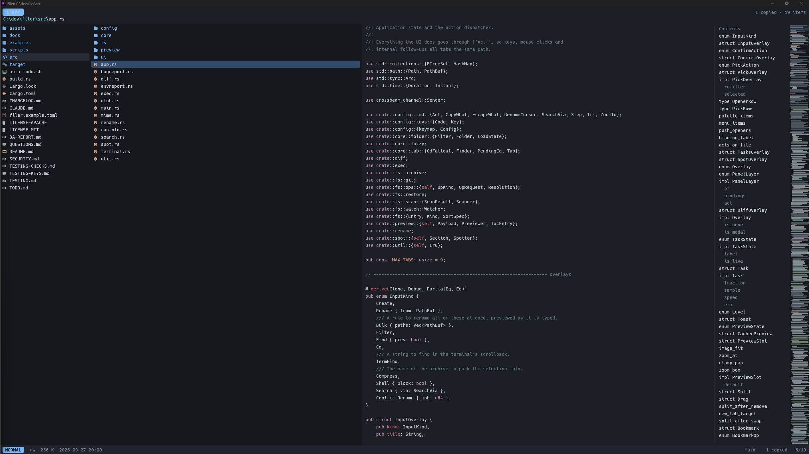
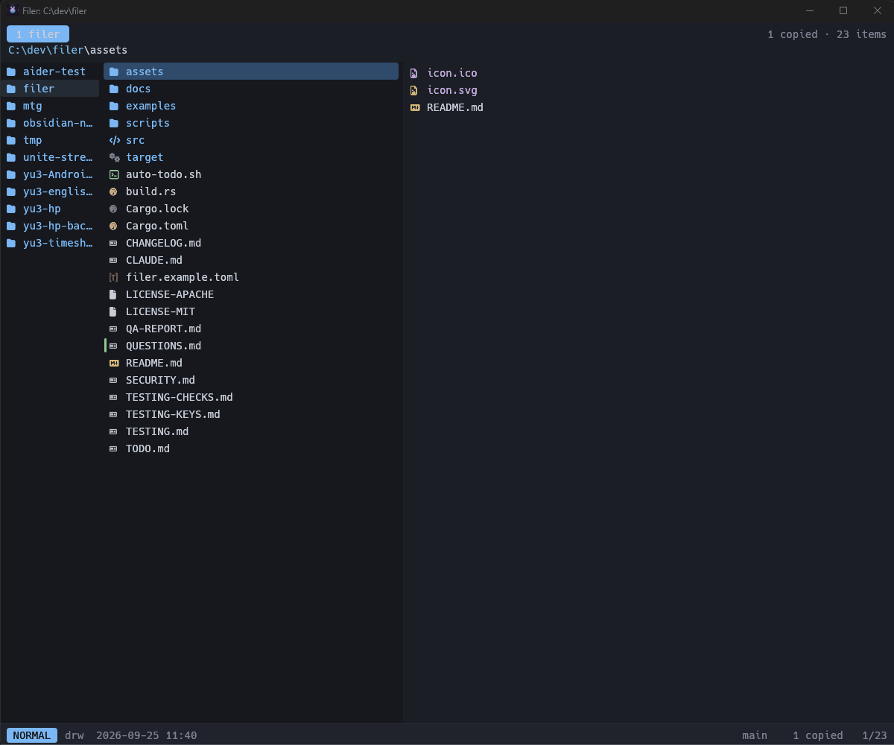
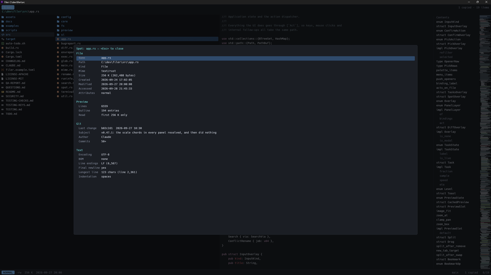

# Filer

A keyboard-driven file manager for Windows, written in Rust with [egui](https://github.com/emilk/egui).
It keeps yazi's feel — three columns, vim keys, chords with a which-key panel, instant previews —
and reads **yazi's own config files**, so an existing `yazi.toml` / `keymap.toml` / `theme.toml`
works as-is.

```
cargo run --release -- C:\some\path
```

## What it looks like



Everything is a keystroke. `j` and `k` walk the list, `l` goes in, `h` comes back, and a
chord left half-typed brings up the panel that says what the other half could be:



`<Tab>` asks about whatever is under the cursor. The answer is assembled from whichever of
the panel's providers has something to say about that file — its own details, what the
previewer found inside it, the commit that last touched it, how it is encoded:



## Getting a build

A [release](https://github.com/uchmk/filer/releases) carries a `.zip` for Windows x64 and ARM64, and
a `.tar.gz` for macOS and Linux. No account needed.

The Windows zip holds `filer.exe` with `conpty.dll` and `OpenConsole.exe` — a newer ConPTY, from
Microsoft's own package, with its MIT notice — and `filer.com` (v0.71.0). **Keep them in one folder.**
filer runs without the ConPTY pair, but then the terminal pane falls back to the one built into
Windows, which is old enough to break programs run in it: lazygit starts with a menu nobody opened.

`filer.com` is a small console program that makes `filer` behave like any other command in a
terminal. `filer.exe` is a windowed program, and PowerShell neither waits for one at the end of a
pipeline nor connects its `>` to one, so `$v = & filer.exe env` comes back empty. Windows tries
`.com` before `.exe` when you type `filer`, so `filer.com` answers. For `env`, `--version`, `--help`
and `shell-hook` it runs `filer.exe` and waits; for anything else it opens the window and gives the
prompt back once the window is up. Visual Studio ships `devenv.com` beside `devenv.exe` for the same
reason. Building filer yourself, `cargo build --release` makes `filer-com.exe`: copy it to
`filer.com` beside `filer.exe`. Building filer
yourself, `pwsh -File scripts\fetch-conpty.ps1` puts the pinned version beside
`target\release\filer.exe` (and `-Dest target\debug` beside a debug build).

**Windows will warn you about the download, and it is right to.** The binaries are not code-signed,
so the publisher shows as unknown; SmartScreen adds its own warning because a file published today
has no download history to weigh. This happens on every machine and every release, personal or
managed — it is not a judgement about your computer.

What that warning asks you to confirm, you can actually check. Every release asset's SHA-256 is
published on the release page, so comparing it tells you the file is the one CI built from that
tag's commit, unaltered in transit:

```powershell
Get-FileHash .\filer-v0.0.0-windows-x64.zip -Algorithm SHA256 | Format-List Hash
```

A matching hash does not remove the warning — only a signing certificate does, and there isn't one.
See QUESTIONS.md Q14 for what that would take.

macOS is the same story with a different name: the binaries are unsigned, so Gatekeeper refuses them
until they are allowed through by hand.

## Why it feels fast

Nothing that touches the disk runs on the UI thread.

| Concern | How it is handled |
| --- | --- |
| Directory listing | A small pool of scan threads (`[tasks] micro_workers`); results are routed by request id, stale ones are dropped |
| Revisiting a directory | An LRU of listings makes `h`/`l` instant; a background rescan refreshes behind the scenes |
| Huge directories | Only the visible rows are laid out and painted — a 200k-entry directory costs the same as a 20-entry one |
| Previews | One worker, newest-request-wins, plus a 40 ms debounce so scrolling never hits the disk; syntax highlighting happens in the worker |
| Images | Decoded and downscaled off-thread, uploaded once as a texture |
| File operations | A sequential job queue with progress and conflict prompts |
| Repaints | Event-driven: egui only redraws when something actually changed |
| External changes | Watched via `notify`, debounced 150 ms, then rescanned |

## Configuration

Files are read in this order — later ones win:

1. `%YAZI_CONFIG_HOME%`, else yazi's own directory — `yazi.toml`, `keymap.toml`, `theme.toml`
2. `%FILER_CONFIG_HOME%`, else `<base>\filer` — the same three, plus `filer.toml`

`<base>` and the first layer differ by platform, because filer looks wherever yazi itself keeps
its files:

| Platform | yazi's files (layer 1) | filer's overrides (layer 2) |
| --- | --- | --- |
| Windows | `%APPDATA%\yazi\config` | `%APPDATA%\filer` |
| Linux | `$XDG_CONFIG_HOME/yazi` (default `~/.config/yazi`) | `~/.config/filer` |
| macOS | `~/.config/yazi` | `~/.config/filer` |

The trailing `config` in layer 1 is a quirk of yazi's Windows layout, not part of the path
elsewhere. macOS uses `~/.config` rather than `~/Library/Application Support` for the same
reason: that is where yazi reads from. Run `filer env` to print the directories in effect and
which files were actually found.

Press `~` or `F1` in the app: the help panel lists which config files were actually loaded, any
warnings, and every key binding in effect. `C` there copies it as text, one key per line. On Windows
everything filer copies ends its lines with CRLF, as Windows programs expect (v0.67.24).

The two files are not interchangeable: `[ui]`, `[term]`, `[[preview]]` and `[line_args]` are read
only from `filer.toml`, and `[mgr]`, `[opener]`, `[open]`, `[tasks]` and `[preview]` only from
`yazi.toml`. Putting one in the other is reported as a warning, since both files ignore keys they
do not know and the setting would otherwise just quietly do nothing. `preview` is the one name
both use — a table of sizes in `yazi.toml`, an array of commands in `filer.toml` — so the wrong
shape fails the whole file rather than being ignored, and the warning says so.

### yazi.toml

Honored: `[mgr]` (`ratio`, `sort_by`, `sort_reverse`, `sort_dir_first`, `sort_sensitive`,
`linemode`, `show_hidden`, `scrolloff`, `title_format`), `[preview]` (`wrap`, `tab_size`,
`max_width`, `max_height`), `[opener]`, `[open].rules`, `[tasks].micro_workers`.
`[manager]` is accepted as an alias for `[mgr]`. Unknown keys are ignored rather than rejected.

`title_format` takes yazi's `{cwd}`, and two of filer's own (v0.59.8): `{rows}`, the list rows on
screen, and `{pane}`, the terminal pane's grid as `12x159` (empty while it is closed). A script that
reads the window title gets both without pressing a key: `title_format = "Filer: {cwd} [{rows}] {pane}"`.

Opener placeholders `$@`, `$0`, `%*`, `%0` and `%s` all expand to the selected paths.

The terminal pane takes a third of the window, which suits a shell and is too little for a
full-screen program. `<C-S-Enter>` (`term_max`, also `plugin toggle-pane max-term`) gives it the
window **to the top edge** — no header, no list, only the status bar below — and works while the
terminal holds the keys, which is the state a TUI puts you in. Maximizing hands the pane the keys,
since a hidden list is nowhere to aim them, and **every way out of the pane restores the size**:
`<C-t>` gives the keys back and the window with them, in one press. `q` and `Esc` cannot do this —
binding them here would stop them reaching the shell, and a pane whose keys filer keeps is not a
terminal.

When a program in the pane misbehaves, two tools show what actually passed between them. Set
`FILER_PTY_LOG` to a file path before starting filer, and every chunk crossing the pane's PTY is
appended to it — what the shell side wrote (`out`), and what filer wrote back, split into `in key`,
`in paste` and `in reply` (the terminal's own answers to a program's queries). `scripts/keyprobe.ps1`
shows the other end: the console key records a program receives, read the way tcell reads them, and
with `-Query` it sends tcell's startup queries and prints the replies as they arrive.
`block = true` gets its own console window (so `nvim` works); everything else starts without one.
On Linux and macOS, where a GUI program has no console to give, `block = true` opens a terminal
window instead: `$TERMINAL` if set (arguments allowed, e.g. `TERMINAL="kitty --single-instance"`),
then Terminal.app on macOS, then the first installed of `x-terminal-emulator`, `gnome-terminal`,
`konsole`, `xfce4-terminal`, `kitty`, `alacritty`, `wezterm`, `foot`, `ghostty` and `xterm`.
If the program fails, the window stays open on its exit code until you press Enter. `filer env`
names the terminal it will use.
Rule patterns take `*`, `?`, `[abc]` and `{jpg,png}`, which is what yazi's own rules are written
with.

### Openers — what `<Enter>` and `<S-Enter>` offer

`<Enter>` runs the first opener that applies; `<S-Enter>` shows all of them and lets you pick.
Both lists come from your own `yazi.toml` — nothing is built in, so an editor that is not in
there cannot appear. Two tables do the work: `[opener]` names the lists, `[open].rules` says
which list a file gets.

```toml
[opener]
# The list `<Enter>` reaches for on a text file. Order matters: the first entry wins.
edit = [
  { run = 'nvim %*', desc = "Neovim", block = true },
  { run = 'code %*', desc = "VS Code" },
  { run = '"C:\Program Files (x86)\sakura\sakura.exe" %*', desc = "サクラエディタ" },
]

# Anything the OS already knows how to open.
open = [{ run = 'start "" %*', desc = "Open with the default app" }]

browser = [
  { run = 'start "" msedge %*', desc = "Edge" },
  { run = 'start "" chrome %*', desc = "Chrome" },
]

# Naming the programs is only needed to override the file association — the
# `open` list above already reaches Office through it. One list per program:
# `<Enter>` takes the first entry, so a shared list would hand every Word file
# to Excel. PowerPoint's executable is `powerpnt`, not `powerpoint`.
excel = [{ run = 'start "" excel %*', desc = "Excel" }]
word = [{ run = 'start "" winword %*', desc = "Word" }]
powerpoint = [{ run = 'start "" powerpnt %*', desc = "PowerPoint" }]

[open]
rules = [
  { name = "*.pdf", use = ["browser", "open"] },
  { name = "*.{xlsx,xlsm,xls,csv}", use = ["excel", "open", "edit"] },
  { name = "*.{docx,docm,doc}", use = ["word", "open"] },
  { name = "*.{pptx,pptm,ppt}", use = ["powerpoint", "open"] },
  { name = "*.{txt,md,toml,rs,py,json,yml,yaml,ini,log}", use = ["edit", "open"] },
  { name = "*", use = ["open", "edit"] },        # the fallback, last
]
```

Every rule that matches contributes, in the order written, so the catch-all at the end adds
*Open with the default app* to everything without taking the top spot from a more specific rule.
`<S-Enter>` shows `desc` with the command line beside it, so name them however you think of them.

Two Windows details worth knowing, both of which turn "it does nothing" into "it works":

- **`start "" ` in front of a GUI program that is not on `PATH`.** Commands run through
  `cmd /C`, which searches `PATH` and nothing else; `excel.exe` and `msedge.exe` are not on it.
  `start` asks the shell instead, which knows where installed programs live. The empty `""` is
  the window title `start` would otherwise steal the program name for.
- **Full paths need the quotes shown above**, and the `%*` stays outside them. The paths filer
  substitutes are quoted for you, so a name with a space stays one argument either way.

An editor listed here also gets the line number when you open from the outline, if filer knows
its syntax — サクラ, EmEditor, Notepad++, VS Code and the vim family are known already, and
[line_args](#line_args-opening-an-editor-at-a-line) covers the rest.

### keymap.toml

Layering matches yazi: `prepend_keymap` → (`keymap` or the built-in defaults) → `append_keymap`,
and the first exact match wins. That is what lets a prepended single-key `m` shadow the built-in
`m`-prefixed chords.

`on` accepts a single token (`"T"`), a sequence string (`"gg"`) or an array (`["g", "g"]`).

In `run`, quotes group words as in a shell (`run = "shell 'git log' --block"`). On Windows a backslash
is part of a path, not an escape, so `run = 'cd C:\Users\me\work'` goes where it says; the one
escape kept is `\"` inside double quotes. Elsewhere a backslash escapes the next character, as in a
POSIX shell (v0.59.0; before that a Windows path written without quotes lost its backslashes).
Key notation is yazi's: `<C-a>`, `<A-S-Up>`, `<Enter>`, `<Space>`, `<F5>`, `<lt>`.

**Line mode** is yazi's name for the right-hand column of the file list — the one value shown
beside every name. `m`+`s` shows the size, `m`+`t` the modified time, `m`+`b` the created time,
`m`+`p` the permissions, `m`+`u` the totals `gu` measured (v0.57.5; the way back to them inside
the usage view after another `m` key), and `m`+`n` turns the column off. `[mgr] linemode` in `yazi.toml` sets
the one you start with.

The names are `none`, `size`, `usage`, `mtime` (or `modified`), `btime` (or `created`),
`permissions` and `owner` — `owner` is accepted and shows nothing, because filer does not read it
yet. Anything else is **refused rather than ignored**: a misspelling in `yazi.toml` is a warning
about that file, and one in a `linemode` binding is listed as an unsupported command in the help
panel and says so when the key is pressed. It used to leave the column silently blank, which looked
the same as asking for no column at all.

> If `m` on its own does something — saves a bookmark, say — none of these run: the bookmark
> plugins for yazi bind `m`, and a `prepend_keymap` line goes in front of every chord that starts
> with it. Filer reports this on startup and lists it under `~`.

Commands implemented: `escape`, `quit`, `close`, `arrow`, `leave`, `enter`, `back`, `forward`,
`cd`, `reveal`, `follow`, `refresh`, `seek`/`peek`, `tab_create`, `tab_close`, `tab_switch`,
`tab_swap`, `toggle`, `toggle_all`, `visual_mode`, `open`, `yank`, `unyank`, `paste`, `link`,
`hardlink`, `remove`, `create`, `rename`, `copy`, `shell`, `hidden`, `linemode`, `sort`, `find`,
`find_arrow`, `filter`, `search`, `help`, `tasks_show`, `spot`, `noop`, plus `undo`, `redo`, `jump`,
`bulk_rename`, `compare`, `quick`, `zoom`, `minimap`, `config_reload`, `palette`,
`menu`, `extract`, `compress`, `send_pane`, `terminal`, `term_send`, `term_cd`, `term_find`, `term_scroll`, `task_toggle`, `task_cancel`, `task_top`,
`split`, `pane_focus`, `toggle_render`, `toggle_outline`, `usage` and `bug-report` (the last two
this project's own). `select` and `select_all` are accepted as `toggle --state=on` /
`toggle_all --state=on`. In the `[input]` section: `close --submit` (and the `*_do` spellings),
`close` and `complete`; in `[spot]`: `close`, `arrow`, `swipe`, `enter`, `copy cell` and `copy all` (this project's own: the whole panel, `Label<TAB>value` per row); in `[term]`:
`close` and anything from `[mgr]`, with every other key going to the shell; in `[diff]`:
`close`, `arrow`, `find_arrow`, `enter` (comparing folders: compare the files on the row) and `hide_same` (this project's own: hide or show a folder comparison's matching rows); in `[help]`: `close`, `help` (which closes it too), `arrow`, `copy all` (the whole panel as text, as in `[spot]`) and `config_reload` (`<C-F5>`, the key the panel's config rows name; the panel stays open).

A few plugin invocations are mapped onto built-in behavior so common setups keep working:

| In `keymap.toml` | Effect |
| --- | --- |
| `plugin toggle-pane max-preview` | Maximize / restore the preview pane |
| `plugin toggle-pane min-parent` | Hide / show the parent pane |
| `plugin bookmarks save` / `jump` / `list` / `delete` / `delete_all` | Bookmarks (press the key to assign or jump) |
| `plugin smart-enter`, `plugin smart-filter` | `open` (a directory is entered), `filter --smart` |

Anything else parses cleanly, reports itself as unsupported in the help panel, and shows a toast
if you press it — it never breaks config loading. There is no Lua runtime.

What a plugin is mostly used for — a custom action on the file under the cursor — is written here
as a `shell` binding or as an `[opener]` entry, and both show up on their own in the
[context menu](#context-menu) and the [command palette](#command-palette). Nothing has to be
registered: the menu is read back out of the config every time it opens.

### theme.toml

`[app] overall` (the window's background and text), `[mgr]` colors, `[status]` modes, `[which]`,
`[git]`, `[filetype].rules` and `[icon]` (`globs`, `dirs`, `exts`, `files`, `conds`) are applied on
top of a built-in dark theme. A light theme starts with `[app]` / `overall = { bg = "#ffffff", fg =
"#222222" }`; the preview's text keeps its own colours, from `syntect_theme` below. Colors may be ANSI names
(`lightblue`, `darkgray`, `reset`) or hex (`#7ab8f5`). `syntect_theme` selects the preview's
syntax theme.

### filer.toml (GUI-only settings)

[`filer.example.toml`](filer.example.toml) in this repository is a commented copy of the defaults —
copy it to `%APPDATA%\filer\filer.toml` and edit from there.

```toml
[ui]
font_size = 14.0
row_padding = 4.0
fonts = []                 # explicit font file paths, tried first
bold_fonts = []            # explicit bold font file paths, tried first
icons = "auto"             # auto | nerd | ascii | none
render_markdown = true     # start Markdown previews rendered (`M` toggles)
preview_debounce_ms = 40
max_text_bytes = 262144
max_history = 200
window_width = 1360.0
window_height = 860.0
backend = "auto"           # auto | vulkan | dx12 | metal | gl; read at start

[term]                     # what `<C-t>` starts; omit for the default
# shell = "powershell"     # Windows without this is pwsh (7) when installed, else 5.1
# args = ["-NoLogo"]
```

`backend` picks what draws the window (v0.74.0). `auto` is GL on Windows when the machine has it,
and wgpu's own pick otherwise (v0.75.0): on some AMD GPUs a driver thread keeps an idle window's core
busy under Vulkan and DX12, and GL stops it. A Windows machine without GL gets Vulkan or DX12 without
a word; write `backend = "vulkan"` or `"dx12"` to choose one of them yourself. The
`WGPU_BACKEND` environment variable still wins for one run. On Windows `gl` may come through a
translation layer, so `filer env`'s `Adapter` can read `D3D12 (…) (Gl, Other)` and still be GL (the
ARM64 laptop's does, #239). A backend this machine has no adapter
for falls back to `auto` and says so among the config warnings, rather than leaving no window; a
name filer does not know, or `metal` off macOS and `dx12` off Windows, is warned about when the file
is read, so `filer env` shows it too, beside a `Backend` row with the value in force.

Fonts are auto-detected: a Nerd Font from your user font directory (HackGen, FiraCode,
CaskaydiaCove, JetBrainsMono) first, then Meiryo / Yu Gothic for CJK coverage. If no Nerd Font is
found, icons fall back to plain ASCII automatically.

Bold text (headings, `**strong**`) uses a real bold face: the `-Bold` sibling of the regular font
(e.g. `HackGen35ConsoleNF-Bold.ttf`) or Meiryo / Yu Gothic Bold. Without one it is faked by
drawing the glyphs twice.

### line_args (opening an editor at a line)

Opening at a line (see [Outline](#outline-contents)) knows a list of editors by heart. Any other
editor — and any of the built-in ones you disagree with — can be given its own syntax here:

```toml
[line_args]
mikan = "-l {line} {path}"          # mikan.exe -l 123 "C:\a b\x.txt"
myedit = "{path}:{line}"            # myedit.exe "C:\a b\x.txt:123"
"notepad++" = "-n{line} {path}"     # the built-in entry, spelled out
```

The key is the program's file name, lowercased, without `.exe` / `.cmd` / `.bat`; the value is the
arguments, which must name `{path}` exactly once. They take the place of the opener's own path
placeholder, so the rest of its command line (`nvim -O %s`) is kept. The path is quoted for you,
together with whatever sits next to it in the same word — `{path}:{line}` comes out as
`"C:\a b\x.txt:123"`, never as a broken pair of words.

## Markdown preview

`.md` / `.mdx` files are rendered: headings, emphasis, lists and task lists, tables, block quotes
and GitHub alerts, with fenced code blocks highlighted by language. `M` switches between the
rendered view and the highlighted source, keeping your place.

## Outline (Contents)

The preview keeps an outline of the file: the headings of a rendered Markdown file, or the
functions, types, classes, modules and TOML tables of source code (taken from the same syntax
highlighting pass, so every language with a grammar works, nested by indentation). When the pane
is wide enough — about 80 columns for Markdown, 100 for code, e.g. with `max-preview` — it sits on
the right as a Contents column that tracks the scroll position; clicking an entry jumps there.

`l` / `→` on a file hands the keys to the outline (on a file without one it does nothing; files
are opened with `<Enter>`). `<S-Tab>` does the same and also toggles back, saying so in a toast
when the file has no outline. While the outline has the keys the file list's cursor dims,
`j` / `k` / arrows / `gg` / `G` / `<C-d>` move through the entries and the preview follows.
`<A-k>` / `<A-j>` still scroll freely.

`<Enter>` opens the file at the selected entry's line, and `<S-Enter>` does the same with the
editor you pick. The line is passed as `+N` to nvim / vim / nano / emacs / micro / kak, as
`-g file:N` to VS Code / Cursor / Windsurf, as `file:N` to Helix / Sublime / Zed, and on Windows
as `-Y=N` to Sakura, `/l N` to EmEditor and `-nN` to Notepad++; other openers
(Notepad among them) just open the file. Any editor can be taught the syntax — or an entry of the
list above overridden — with [`[line_args]` in filer.toml](#line_args-opening-an-editor-at-a-line). `<Esc>`, `h` / `←` or `<S-Tab>` gives the keys back to the file list,
and any other key does so too before doing its usual job. In a narrow pane the outline shows as an
overlay only while it has the keys.

## Spot

`<Tab>` opens yazi's spot panel for the hovered file:

- **File**: name, path, kind, MIME type, size (or item count), created / modified / accessed
  times and attributes, straight from the listing.
- **Preview**: what the preview found (line count, outline entries, whether only the head was read).
- Per type, read on a worker thread:
  - **Archive**: entry and folder counts, unpacked size, compression ratio, and whether it is
    encrypted — the entries, or the table of contents itself. Only the index is read, so nothing is
    unpacked however large it is, and no entry name is kept.
  - **Text**: encoding and BOM, line endings (with counts, and `mixed` where a file has both),
    whether the last line ends with a newline, the longest line, and whether it is indented with
    tabs or with spaces of some width.
  - **Executable**: format, architecture and kind for PE, ELF and Mach-O, read from the file's own
    header — a universal binary lists its slices. Architectures are named as Rust names its targets
    (`x86_64`, `aarch64`), so the answer can be held against the triple a build was made for, and a
    machine value this build does not know is shown as the number rather than guessed at. Nothing
    here is gated on the host: a PE reads on Linux and an ELF on Windows.
  - **Document**: an OOXML file's own properties — title, author, who saved it last, created and
    modified times (in UTC, as the file stores them), revision, the application that wrote it, and
    the word / page / slide count. The pre-2007 `.doc` / `.xls` / `.ppt` are not read.
  - **Link**: what kind (`Symlink`, `Symlink (relative)`, `Hardlink`), the target as it is stored,
    and where it actually resolves — a relative link shows both, which is the difference between
    `-` and `_`. A **hardlink** is the one the rest of the app cannot show: it is an ordinary
    directory entry over the same bytes, so no row marks it, and the panel is the only place the
    link count appears. On Windows the other names are listed too (`Also at`); Unix can count them
    but not find them, since that would mean walking the filesystem for a matching inode.
  - **Git**: the last commit that touched the hovered path — short hash, date, subject, author —
    and how many commits have, counted to 50 and then reported as `50+`. The listing already
    carries git's *state* per row; this is its history, for the one row under the cursor, so
    "when did this change, and why" does not need a terminal. `git` on `PATH` answers, as it does
    for the status marks; outside a repository, or for a file never committed, no section appears.
    - **Where it came from**, too: `Came in via` names the pull request that brought that commit in
      and the merge commit's own hash, and `From branch` the branch it merged. A merge commit's
      subject is `Merge pull request #61 from owner/branch`, so **the number is already on disk** —
      nothing is fetched, no token is involved, and the section behaves the same with the network
      unplugged. GitLab's and git's own `Merge branch 'x'` give the branch without a number, and a
      subject in neither shape still shows the merge. A commit pushed straight to the branch, or one
      not merged yet, gets **no such rows**: a merge that merely came *later* is not credited,
      which is checked by asking git whether the commit was already on the merge's first parent.
    - When `origin` is on GitHub, a `Pull request` row gives the page's address, built from
      `remote.origin.url`; **`<Enter>` on it, or on `Came in via`, opens it.** Nothing is fetched
      until you do.
    - A commit the clone's default branch (`origin/HEAD`) does not contain yet gets a
      `Not merged` row — `not in origin/main yet` — so a commit waiting on review no longer looks
      like one pushed straight to `main`. Without `origin/HEAD` there is no row: the default branch
      is not guessed. Like everything here it reads local refs, so it is as current as the last fetch.
  - **`C`** copies the whole panel as text — each section's title, then `Label<TAB>value` per row —
    for a bug report or a chat, where a screenshot used to go; `c` still copies the one value.
      Browsing pull requests *as a list* is a different job, and tools like `gh-dash` already do it;
      this is the other direction, where the file under the cursor is the question.
  - An image's real dimensions, format and color type, a font's family / style / version / weight /
    glyph count, a directory's file and subdirectory counts.

The keys are the list's own, so that the panel reads the way `<F3>` does — quick look is a flag
rather than an overlay, so there the `[mgr]` layer stays live and `hjkl` keep their usual meanings.
`j` / `k` / `↑` / `↓` move to the previous / next file and `h` / `l` / `←` / `→` change directory,
the panel following the cursor wherever it lands; `<A-j>` / `<A-k>` (and `<A-↑>` / `<A-↓>`) select a
row of the panel; `c` / `y` copy the selected value; `<Esc>` / `q` / `<Tab>` close it. The plain
keys move around, the `<A->` keys move inside what is open. Before v0.21.0 it was the other way
round, with `j` on the panel's rows and `h` / `l` on the files. Each kind of detail is one provider
function in `src/spot.rs` — a `fn(&Path) -> Option<Section>` in a list, which is how the four above
were added — so more (e.g. Windows property-system values like media length or EXIF) can be added
without touching the panel.

## Split view (two panes)

`<C-w>` splits the window in two and, from then on, moves the keys between the panes. The second
pane takes the parent column's place, so the layout stays three columns wide: pane, pane, preview.
`<C-S-w>` closes it (`split close`; `split` alone toggles, `split open` / `split close` are explicit).

The second pane is just another tab, shown side by side. That is what keeps everything else
working: the focused pane is always the current tab, so every command — `cd`, `yank`, `paste`,
filter, search — runs on it with no notion of panes at all, and copying between panes is the
ordinary `y` … `<C-w>` … `p`. Splitting with one tab open creates a second one on the same
directory; with several, it borrows the next tab. `[` / `]` / `1`–`9` still switch tabs, and
switching to the tab the other pane shows just moves the keys there. Closing or swapping tabs
keeps the panes pointed at the right ones; closing the tab the other pane holds ends the split.

`<A-c>` copies the selection into the other pane and `<A-m>` moves it — one key instead of
`y` `<C-w>` `p`. The other pane's directory is already on screen, so naming a destination is the
step worth removing; the yank register is left alone. Dragging does the same: drag a row (or a
selection) onto the other pane to copy it, with `Shift` held to move it, the way Explorer does.
The pane about to receive the drop is outlined and the pointer says which it will be.

Neither is on `F5` / `F6` on purpose. `F5` is refresh here as it is in every browser, so putting a
file operation there would write files for someone reaching for a reload; and `F6`/`F7` would
half-match Total Commander, where `F6` means *move* — worse, because the mismatch loses data
rather than just surprising. Rebind them in `keymap.toml` if your fingers disagree.

The pane with the keys is outlined and keeps the bright cursor; the other is dimmed. Clicking the
dim pane takes the keys first, so a click, a `Shift`+click or a double-click always lands on the
pane you aimed at. Both panes are watched for changes and rescanned, the passive one at a lower
priority so the focused directory is never made to wait behind it.

## Command palette

`<C-S-p>` (`Cmd`+`Shift`+`P` on macOS) lists every `mgr` binding — the built-in ones and whatever
your `keymap.toml` added — and runs the one you pick. Each row carries the description and the
command text, so `tasks_show` and `task manager` both find the task panel; the key that runs it is
shown on the right. A command bound to several keys appears once, under the first key the keymap
gives it, and commands the config left unsupported are left out.

`↑` / `↓` (or `<C-p>` / `<C-n>`) move, `<Enter>` runs, `<Esc>` closes, and a click runs the row
directly. Commands that need more input (`rename`, `filter`, `shell`, …) open their own prompt
as if the key had been pressed.

The openers `yazi.toml` lists for the file under the cursor ride along at the end of the list,
named `Open with <desc>`, so a custom action written as an opener is reachable without knowing
which key opens it.

## Context menu

Right-click a row — or press `<S-F10>`, or run `menu` — for what this config says can be done with
that file. There is no fixed list: the rows are read back out of your own configuration.

| Group | Where it comes from |
| --- | --- |
| Openers | `yazi.toml`'s `[opener]` entries that `[open].rules` selects for this file |
| Custom actions | every `keymap.toml` binding that runs `shell` |
| File commands | the bindings that act on a file — `open`, `yank`, `paste`, `rename`, `remove`, `link`, `copy`, `spot`, … |

Commands that only move the cursor or change what the view shows are left out, and anything the
config left unsupported never appears. Each row shows the key that also runs it, so the menu
doubles as a reminder of the keymap.

Right-clicking inside the selection keeps it, and the command acts on all of it — the title says
how many. Right-clicking outside the selection drops it and acts on that one row, the way
Explorer does. This is the nearest thing here to a plugin menu: a `shell` binding or an opener is
how a Lua plugin's action gets onto the screen, with no Lua runtime involved.

## Terminal

`<C-t>` opens a shell in a pane along the bottom, started in the directory you are looking at.
It is a real terminal: a PTY on Unix, ConPTY on Windows, with
[alacritty_terminal](https://crates.io/crates/alacritty_terminal) parsing the escape sequences,
so `vim`, `less` and anything else that paints the screen work as they do anywhere else.

While the pane has the keys, **every key goes to the shell** — that is what makes it a terminal
rather than another set of bindings. Only what the `[term]` keymap section binds is kept:

| Key | |
| --- | --- |
| `<C-t>` | give the keys back to the list, leaving the shell running |
| `<C-S-t>` | close the pane and end the shell — asking first when a program (lazygit, an editor, a build) is still running under it |
| `<F1>` `<C-S-p>` | the key list / the command palette |
| `<C-F5>` | read the config files again, as in the list |
| `<A-Up>` | put the file list where the shell is |
| `<A-j>` `<A-k>` | five lines down / up the scrollback — the keys that scroll the preview from the list |
| `<S-PageUp>` `<S-PageDown>` | half a screen back / forward through the scrollback |
| `<S-Home>` `<S-End>` | to the top of the scrollback / back to the bottom |
| `<C-S-f>` `<C-S-n>` `<C-S-b>` | find in the scrollback / next match / previous |

Shift is what keeps most of those out of the shell's way: a program reading the keyboard sees
`PageUp`, never `<S-PageUp>`. `<A-j>` and `<A-k>` are the exception, and they cost something — a
plain Alt+letter *does* reach the program, so a `nvim` run inside this pane no longer sees them.
That is deliberate: these two mean "scroll what I am reading" in every other pane, and the one
place they did nothing was the one you noticed.

They are handed back automatically where it matters. A full-screen program — `nvim`, `less`,
`htop` — runs on the terminal's *alternate screen*, which is created with no scrollback at all, so
a scrolling key there would be spent on a scroll that cannot move anything. While that screen is up
every `term_scroll` key goes to the program instead, and so does the wheel: as the mouse to a
program that asked to hear about the mouse (`nvim`, `htop`, `tmux` — so the view scrolls and the
cursor stays put), and as arrow keys to one that did not (`less`), rather than walking a scrollback
that does not exist. Keys that are not about scrolling stay filer's:
`<C-t>` has to get you out of a full-screen program as much as out of a shell.

To take the scrolling keys back on the ordinary screen too, replace the whole section with a
`[term] keymap = [...]` of your own, minus these two — `prepend_keymap` cannot do it, because a key
bound to anything here, `noop` included, is consumed rather than forwarded.

`<C-t>` is the way in and the way back out, and it leaves the shell alone: going to and fro is
something you do all day, while ending a shell is something you do a few times, so the destructive
one is the harder chord. The shell's own `<C-t>` — readline's transpose, or fzf's file widget — is
the cost of that, and moving it is one line of `keymap.toml` away. `<C-S-t>` works from the list too,
so the shell can be ended without going back into the pane; with no pane open it says so (v0.67.25).

`Shift` is what keeps those out of the shell's way: a program reading the keyboard sees `PageUp`,
never `Shift`+`PageUp`. Typing anything brings the view back to the bottom, and while it is not
there the pane says how far back it is.

The wheel walks the scrollback. Drag to select and the selection is copied when you let go —
that is what selecting means in a terminal, there is no second step — and a double-click takes
the word. **Right-click pastes**, which is the other half of that pair; `<C-v>` does the same.
Click the pane to take the keys back.

A paste is wrapped in the bracketed-paste markers when the program on the other end asks for
them — bash, zsh, fish and vim do; PowerShell's PSReadLine on Windows does not (5.1 and 7.6 both
measured), so there a multi-line paste runs line by line. That is what keeps a clipboard holding three
lines from running as two commands and a half-typed third: inside the markers a line editor puts
the text in the buffer and waits. A shell that does not ask gets the text plain, where a newline
is Enter and always has been.

The grid is drawn with the list's own font and the theme's colors, so the 16 ANSI colors match
the rest of the window; the 256-color cube and true-color values are used as the program asked
for them.

It follows the pane: change directory and the shell is sent a `cd` for the new one. Typing is the
only way in — a shell takes no other instruction — so that is a line of input like any other,
harmless at a prompt and a nuisance in the middle of a command. It is therefore sent as rarely as
it can be: not when the pane has not moved, and not when the shell has already said it is there.

The saying is OSC 7, the escape a shell emits to report its directory; most send it out of the
box and some have to be told to. filer reads it off the PTY as the bytes go past. A shell that
sends it never hears a `cd` it does not need — including the one that would otherwise chase its
own. `<A-Up>` in the pane goes the other way: it puts the file list where the shell is, which is
what you want after a command has moved it somewhere the list knows nothing about.

`<A-t>` types the selected paths onto the shell's line, quoted so a path with a space in it
arrives as one word. Nothing is run: the line is left for you to put a command in front of. With
the pane closed it opens it first, and the paths go in once the shell has drawn its prompt (or
after five seconds), so they are not typed at a shell still reading its profile (v0.57.0).

## Tasks

Copying, moving, deleting, packing and unpacking all run as jobs on one worker, one at a time —
two copies on the same disk are slower than one. The status bar carries the one being worked on:

```
Copy  42%  18.4 M/s  1m12s  +2
```

the percentage, the speed, how long the rest should take, and how many other jobs are waiting.
The speed is measured over a window rather than between reports, and smoothed, so it stays
readable instead of flickering; the time left is only shown when the size is known, since a file
count says nothing about how big the files are.

`w` opens the panel, which is a list you can act on:

| Key | |
| --- | --- |
| `j` `k` (or `↑` `↓`) | move between jobs |
| `p` | pause the job, or set it going again |
| `x` | cancel it, queued or running |
| `t` | move a queued job to the front |
| `q` `<Esc>` | close |

Pausing lands between files, or between chunks of a large one, never mid-write. A paused job
holds the worker, so nothing behind it starts until it is resumed or cancelled — `t` is how you
change your mind about what should have gone first. The commands are `task_toggle`,
`task_cancel` and `task_top`, bound in the `[tasks]` keymap section.

## Bulk rename

Select some files and press `R`. The prompt takes one rule for all of them, and the panel above it
shows what every name is about to become while you type:

```
IMG_0431.jpg  →  holiday-01.jpg
IMG_0432.jpg  →  holiday-02.jpg
IMG_0433.jpg  →  holiday-03.jpg
```

The rule is a **template** — the new name, with pieces filled in:

| | |
| --- | --- |
| `{name}` | the name without its extension |
| `{ext}` | the extension, dot and all, or nothing where there is none |
| `{n}`, `{n:3}` | the row's number from 1, optionally zero-padded |

The prompt opens on `{name}{ext}`, which changes nothing, so you edit from where you are.
`holiday-{n:2}{ext}` gives the list above.

A rule starting with `s/` is a **regular expression** over the whole name instead, spelled as in
sed and vim: `s/pattern/replacement/`, with `g` for every match and `i` for case-insensitive, `$1`
for a group and `\/` for a literal slash. `s/ copy//g` drops every " copy". The engine is
`fancy-regex`, already in the build for syntax highlighting.

Nothing is renamed until Enter, and Enter is refused outright if any row is a problem — an empty
name, a separator in it, two files given the same name, or a name another file in the directory is
keeping. Those rows are marked in the preview, and the whole batch is one undo step, so `u` puts
every name back at once.

Files swapping names works: renaming `a` to `b` and `b` to `a` moves one aside first and puts it
back, rather than failing on the second rename the way a loop of `mv` would.

## Compare (side by side)

`<A-d>` puts two files next to each other and marks what differs — removals on the left, additions
on the right, in the same two colors the git signs use. The two files are the ones each pane is
standing on when the [view is split](#split-view-two-panes), or the two that are selected when it
is not.

| Key | |
| --- | --- |
| `j` `k` `<C-d>` `<C-u>` `gg` `G` | scroll (move the selection, comparing folders) |
| `n` `N` | to the next / previous difference |
| `z` | comparing folders: hide the matching rows, or bring them back |
| `<Enter>` | comparing folders: compare the two files on this row, line by line; `q` comes back to the folders, on the same row |
| `q` `<Esc>` | close (back to the folders, from a pair opened with `<Enter>`) |

Each side carries its own line numbers, so a line found here can be found in the file. An edited
line sits opposite the line it replaced rather than being listed as a removal and an addition far
apart, and the words that changed inside it are painted stronger than the rest of the row (v0.62.0):
`price` → `cost` in a long line shows as just those two words. A pair of lines with nothing in common
but spaces is a change of the whole line, and is left at the row's tint.

Reading the files and lining them up happens on a worker, so a big file or a slow share never holds
the window. Identical files say so rather than drawing thousands of matching rows, and two files
that are not both text report only whether the bytes match — lining up bytes is nobody's idea of a
diff. The matching top and bottom are peeled off before the work starts, which is what makes a
one-line change in a four-thousand-line file cost nothing; files with nothing in common at all are
laid side by side without being matched up, and say so.

### Two folders

`<A-d>` on **two folders** compares the trees instead, as one list of every path inside them:

```
  =  Cargo.toml
  ~  src/main.rs          12 K → 13 K
  <  src/old.rs            2 K
  >  src/new.rs            4 K
  =  src/ui/
```

`<` and `>` point at the tree that has it, `~` is in both and differs, `=` matches, and `?` is a pair
the same size that was too big to read. The list opens with the cursor on the **first difference**, not
the first row — in a tree that mostly matches, the first screen would otherwise hold none. `n` / `N` walk
between the paths that are not matches, `z` hides the matches altogether (the footer still counts them,
and says they are hidden), and `gg` is the top. One of each — a file against a folder — is refused, since there is nothing
sensible to show for it.

Sizes decide almost every row without anything being read: two files of different lengths differ, and
that is most of them. Only same-sized pairs are opened, compared in blocks and stopped at the first
one that differs, so a file that changed early costs nothing however large it is. Past 64 MB a
same-sized pair is left as `?` rather than read — and it is **not** reported as matching, because
saying two files are the same is a claim and that is the absence of one.

Links — symlinks and junctions — are compared as links, by **where they point**, and never read
through: two links to identical files in different places differ, and a link to a folder is a link,
not something too big to read. A link that points **inside** the folder being compared is compared
by where it lands in that folder, so two copies of one tree read as `=` even though each copy's
links name its own copy (a junction always spells its target in full); a link out of the folder is
compared as written. Very large trees stop after 100,000 paths, half for each side, and say
`cut short`; when a side was cut short, a path the *other* side has is not listed as only there,
because the side that ran out may simply not have reached it. (Both of these were wrong until v0.54.5,
found on a real machine.)

## Quick look

`<F3>` shows the hovered file big, over the panes — the same preview, with room to read it. The
keys are not taken while it is up, so `j` and `k` keep walking the list and the panel follows them
down it; `<A-j>` / `<A-k>` scroll it. `<F3>` again, `<Esc>` or `q` closes it — `q` is what closes
every other panel, and it used to reach `mgr`'s `quit` and end the process with the panel still on
screen.

`T` is the quieter version of the same idea, and yazi spells it
`plugin toggle-pane max-preview`. It widens the preview *column* until it has the body to itself,
so the tab bar, the status bar and the layout stay exactly as they were — no dimming, no frame, no
file name across the top. It is not a panel and nothing is "open": `j` and `k` still walk the list
that is now too narrow to see. `T`, `<Esc>` and `q` all put the columns back: with the list
invisible the screen reads as modal, so every way out of a panel works here too. Reach for `<F3>` to
look at one file and `T` to keep reading while you walk the list.

`q` closes what is in front of you before it quits, the same in every panel — `help`, the task list,
the spotter, a comparison, quick look, a maximized preview. Only with nothing up does the first `q`
end the process.

Worth knowing if macOS's Quick Look is what you have in your fingers: there the up and down keys
scroll the document and left and right step between files, and here it is the other way round.
The panel is built for flipping through a directory at full size rather than for settling into one
file, so the keys that move fastest are the ones that change file.

## Undo

`u` takes back the last thing that can be taken back, `U` does it again. These qualify:

| Step | `u` | `U` |
| --- | --- | --- |
| `d` — files sent to the recycle bin | puts them back where they were | sends them again |
| `r` — a rename | renames it back | renames it again |
| `R` — a bulk rename | puts every name back, in one step | renames them again |
| `x` then `p` — a move | puts the files back where they were | moves them again |
| `a` — a new file or folder | removes it, and the folders made on the way to it, while it is still empty | makes it again |
| `-` `_` `=` — links | removes the links, never what they point at | makes them again |

A move is here and a copy is not, which is the line the rest of the list follows: putting a moved
file back is a rename across directories and deletes nothing, while undoing a copy would mean
deleting the new files to tidy up — a worse thing to get wrong than the operation it was undoing.
`D` asks before it deletes and then means it, so it stays out too. A new file and a link come under
the same line: removing an empty file you just made, or a link, loses nothing. So the file has to
still be empty — once something has been written into it, `u` says so and leaves it — and a link has
to still be the link that was made: a symlink, or for a hardlink the same file as its source, not
something else that has taken the name since.

On Windows a symlink needs Developer Mode or an elevated filer. When `-` on a **folder** is refused
for that, filer asks whether to make a junction instead (v0.67.19): a junction needs no privilege,
but it always holds the full path — never a relative one — and cannot point at a network location,
which is why it is asked and not done. `y` makes it, and `u` / `U` take it back and make it again
like any other link. `c` makes nothing and copies the `cmd /d /c mklink /J …` line instead, for
pasting into a shell yourself (v0.71.4): two absolute paths are too long to retype, and a toast cannot
be copied. The `cmd /d /c` is there because `mklink` exists only inside `cmd`; with it the line runs
in PowerShell too, filer's own pane included (v0.72.6).

Undoing a move starts from where each file actually landed, not from where it was sent: a paste onto
a name already taken lands as `name_1`, and an undo built from the name you asked for would go
looking for a file that was never created.

Putting files back reads the recycle bin, which is a job like any other: it shows in the task panel
and can be cancelled. Each path is matched to the newest thing trashed under that name, so deleting
two files called `notes.txt` an hour apart and pressing `u` brings back the one that just went.

A step that will not go back stays on the stack rather than being thrown away — if something has
taken the name in the meantime, `u` says so, and pressing it again after moving that file out of the
way works. Doing something new after an undo drops what `U` would have redone, the way an editor
does. The stacks hold the last 50 steps and are not written to disk: undo is for the slip you just
made, not a log of the session.

On macOS `u` can still undo a rename, but not a delete: there is no API for reading the Trash back,
only the Finder's own ⌘Z. `u` says so instead of pretending, and the files are in the Trash either
way.

## Git status

In a repository, each row carries a sign for what git says about it:

| Sign | Meaning | Default color |
| :---: | --- | --- |
| `M` | changed in the working tree | yellow |
| `+` | staged, matching the index | green |
| `?` | untracked | gray |
| `D` | deleted, or a staged delete | red |
| `!` | an unfinished merge | red |

A directory carries the strongest state of anything inside it, so a conflict shows from the top of
the tree down. A file both staged and changed since reads as changed — that is the part still to be
committed. The colors come from `theme.toml`'s `[git]` section (`modified`, `added`, `untracked`,
`deleted`, `updated`), the same keys yazi's git plugin uses.

`git` on `PATH` is what answers: one `git status --porcelain` per listing, run on a worker, so a
big repository never holds up the window and whatever version of git is installed is the one that
decides. Nothing is linked in, so this costs no C dependency and no build step. Where there is no
repository — or no git — the rows simply carry no signs. The status refreshes with the listing, so
a file operation or a change the watcher catches updates the signs with it.

## Disk usage

`gu` measures what is taking up the room here: every child of the current directory with the total of
everything underneath it, biggest first, each with a bar for its share of the largest.

```
  fat/            ████████████   1.2 G
  node_modules/   ██████          611 M
  notes.txt       ▏                12 K
```

The list already answers "how big is this file". What it could not answer is "how big is this
folder", because a directory's own length is the size of its entry on disk and the count in the
`size` line mode is its children one level down — so sorting by size could never find the folder that
is full.

This is the file list, not a panel: `j` / `k`, the wheel, selection, `y`, `d` and the rest work as
they always do, and `<Esc>` leaves and goes back to the directory. Leaving cancels the walk.
While the view is up the right-hand column shows the sizes whatever line mode the tab had, and the
tab gets its own back on the way out (v0.56.0; before that the bars were all you saw unless the
config said `linemode = "usage"`, which made every ordinary folder read `0 B`).
`l` (or `<Enter>`) on a folder goes down into it and measures it in turn, staying in the view, the
way `ncdu` does; `h` comes back up with the cursor on the folder it left, and from the folder `gu`
was pressed in, `h` leaves (v0.63.0). Each level is measured again when you arrive. Rows arrive as each child is measured, so while the walk runs the header counts
them as `N measured so far` rather than `N items` (v0.57.3); the toast with the total says it is done.

Hidden files and anything `.gitignore` covers are **counted**: a folder does not stop taking up room
because git was told to overlook it. Symlinks are not followed, so a link to a directory is one entry
rather than a second copy of a tree. A hard-linked file is counted once, under the first folder the
walk meets, as `du` does (macOS and Linux, v0.75.21); on Windows it is still counted once per name, so a
tree that uses NTFS hard links reads high. Very large trees stop after
200,000 entries and say so, in which case the totals are floors rather than answers: a folder the
walk did not finish reads `≥ 1.2 G`, and one it never reached reads `?` rather than `0 B` (v0.57.2).
`,` re-sorts by the measured totals, and keeps the hidden rows the walk counted.

The order is set when the results arrive, so re-sorting with `,` replaces it; `<Esc>` and `gu` again
put it back.

## Archives

`e` unpacks the selected archives, `E` packs the selection into one. Both run on the same worker
as copy and move, so a large archive never blocks the window and its progress shows in the task
panel (`w`) with the name of each entry as it goes past.

| Format | Read | Write |
| --- | :---: | :---: |
| `.zip` | ✓ | ✓ |
| `.tar` | ✓ | ✓ |
| `.tar.gz`, `.tgz` | ✓ | ✓ |
| `.7z` | ✓ | ✓ |

Everything is done in-process by pure-Rust crates (zip, tar, flate2, sevenz-rust2): no 7-Zip
installation, no C toolchain, and the same behavior on x64 and ARM64. `.7z` was read-only until
v0.27.0 — the encoder had been in the binary the whole time, since the 7z crate builds its
`compress` feature by default.

`e` gives each archive a folder of its own, named after it with the extension dropped
(`report.tar.gz` unpacks into `report`), and steps the name past anything already there rather
than merging into it. An archive whose top level is a single folder comes out as that folder
instead of inside a second one named after the archive (v0.66.0): `to-pack.zip` holding `to-pack\…`
gives `to-pack\`, not `to-pack\to-pack\` — the way 7-Zip's "Extract Here" does it. Loose files, or
more than one thing at the top, keep the wrapper so nothing scatters. A selection holding things that
are not archives extracts the ones that are and says how many it skipped.

`E` asks what to call the archive, prefilled with `<name>.zip`. **The extension you type decides
the format** — change it to `.tar.gz` and that is what you get. Names inside the archive are
relative to the directory you are in, so a folder keeps its shape. An archive that already exists
raises the same overwrite / rename prompt a paste does.

Entry names coming out of an archive are treated as untrusted: one that climbs out of the
destination with `..`, names an absolute path or carries a drive letter is refused and reported
rather than written.

Selecting an archive shows what is inside it in the preview pane — size and name, one entry a
line, scrolling like any other preview. Only the table of contents is read where the format has
one (a zip's central directory, a 7z's header), so nothing is decompressed to answer the
question; a tar has no index, so its entries are walked with the data skipped. The first 2000
entries are listed and the pane says when there are more.

**`l` (or `<Right>`) on an archive goes into it** (v0.76.0, Q75): its members are listed like a
folder's, `l` goes down into a folder inside it, `h` comes back up, and `h` at the top -- or `<Esc>`
-- leaves, with the cursor back on the archive. `l` or `<Enter>` on a file unpacks a copy of that
one file into a folder of filer's own under the temporary folder and opens it with the system's
default app; changes to the copy do not go back into the archive. `<Enter>` on the archive itself
still opens it with its opener, as before. **`y` on members, then `p` in a folder, takes them out**
(v0.77.0): each comes out under its own name, a folder with everything under it, through the same
Overwrite / Skip / Rename question a copy asks, and the cursor lands on it. Otherwise the view is read
only: `x`, `p`, `d`, `r`, `a`, `e` and the like say so instead of acting. A file of up to 4 MB is
unpacked on a worker and previewed like any other (v0.78.0); a folder, or a bigger file, shows a card
with its size or how many entries it holds. The preview's copies go when you leave the archive; the
copies `l` opened are kept while an editor may have them, and a later start clears those a day old. Up to 100,000 entries are listed.

## Scrolling the preview, and the minimap

The preview scrolls without the file list losing the cursor: `<A-k>` / `<A-j>`, or the wheel with the
pointer over it. Only the lines on screen are ever drawn, and only the first
256 KiB of a file is read at all (`max_text_bytes`), so a huge log opens as fast as a short one.

There is no scrollbar — this is a pane of lines, not a `ScrollArea`, because measuring ten thousand
lines to know how tall the content is would cost the frame that virtualizing just saved. The
**minimap** down the right takes its place:

```
    fn draw(…) {            ▏▔▔▔▔▔
        let rect = …;       ▏  ▄▄▄▄
        …                   ▏ ▟▓▓▓▓   ← where the pane is looking
```

Each band is one rectangle spanning the widest line in it, colored by what syntect said, so a block
of code reads as a block, a comment header as a lighter band, and a blank run as a gap. No glyphs
are drawn: at two pixels a line a letter is a smudge, and laying out ten thousand of them is exactly
the cost being avoided. The rows are summarised on the preview worker, six bytes a line.

Click or drag the minimap to go there — the line pointed at lands in the middle of the pane.

Rest the pointer on it for a moment and the line under it appears beside the strip, with its number:
the line a click would jump to, in the colours the body uses. A band carries no text by design, so
this is the question the strip cannot answer on its own. It waits out the same delay as any tooltip
(`interaction.tooltip_delay`, 0.4 s), and it keeps up during a drag, so you can look for a place
before letting go. Style it with `[mgr] preview_hovered` in a yazi `theme.toml`; the default
underlines it.

It appears where the pane is wide enough to spare seven columns, and `<A-n>` (or `[ui] minimap = false`
in `filer.toml`) turns it off. Rendered Markdown gets none: its lines are not the file's lines, so
the box would point at the wrong place, and its [Contents](#outline-contents) column already answers
"where am I". Switch it to source with `M` and the map comes back.

## Image previews

| Key | |
| --- | --- |
| `<A-i>` `<A-o>` | zoom in / out |
| `<A-0>` | fit the pane (where every image starts) |
| `<A-1>` | 1:1, one image pixel per point |

`Ctrl` and the wheel zoom about the pointer, so the thing being looked at stays under the cursor
instead of sliding away as it grows. Dragging pans, and a double-click goes back to fitting. The
caption carries the scale (`fit 34%`, `1:1`, `250%`), because whether what is on screen is the real
pixels is the first thing worth knowing. A zoom belongs to the file it was set on: walking to the
next image starts it fitted again.

The worker decodes into the pane's size, so magnifying would show a blurred copy of a small
texture. Instead the zoom asks for a **bigger decode** — the box size is part of the preview's
identity, so the newest-wins worker and the cache handle it with nothing added. The box steps in
powers of two and stops at 4096, so dragging the zoom about costs a handful of decodes rather than
one a frame, and the picture on screen stays put while the sharper copy is read: the geometry
follows the image's own dimensions, never the texture's.

## Other previews

Nothing here needs an outside tool — see [Previewers of your own](#previewers-of-your-own) for
what one buys you:

| Files | Preview |
| --- | --- |
| png, jpg, gif, bmp, ico, webp, tiff, qoi, pnm | decoded in-process, turned upright per EXIF orientation |
| svg | rendered with resvg, scaled to fill the pane |
| ttf, otf, ttc | a specimen sheet: name, alphabet (kana/kanji when the font has them), size waterfall; symbol fonts show a glyph grid |
| csv, tsv | an aligned table, with `M` switching to the raw text |
| docx, xlsx, pptx | read out as text: paragraphs, rows, slides. **No Office needed** |
| heic, avif, jxl, psd, video, audio, pdf | the Windows shell thumbnail — the same one Explorer shows |

Office files are zip archives of XML, so filer reads them itself rather than asking the shell for a
thumbnail Office would have to be installed to provide. It does not try to draw the document — it
takes the text out, which then behaves like any other text preview: scrolling, search, the minimap,
and an outline of a document's headings, a workbook's sheets or a deck's slides. A workbook's sheets
come out in the order its tabs are in, and a date reads as a date rather than the five-digit number
it is stored as. The pre-2007 `.doc` / `.xls` / `.ppt` are a different format entirely and are not
read; one of those renamed to `.docx` says so.

A **csv** or **tsv** is laid out as a table: columns measured and padded, numeric columns
right-aligned, a rule under the header row, and the widest columns squeezed and wrapped where the
table is too wide for the pane — the same layout rendered Markdown uses for its tables, because it is
the same code. Quoted fields are read properly, so a comma or a newline inside `"…"` stays part of
its field. `M` switches to the raw text and back, exactly as it does for Markdown, and the minimap
maps the file rather than the table. A `.tsv` splits on tabs; everything else on commas.

Transparent images are laid over a checkerboard so dark icons stay visible on a dark theme.
Shell thumbnails need a handler for the format: HEIC / AVIF need the HEIF / AV1 Video extensions
from the Microsoft Store, PDF needs one from e.g. Acrobat Reader or PowerToys, and audio only shows
embedded cover art. Without one, a metadata card says what is missing.

### Previewers of your own

A shell thumbnail is one picture — page one of a PDF, the poster frame of a video — and there is no
way to ask it for a second. `[[preview]]` in `filer.toml` names a command that can be asked:

```toml
[[preview]]
match = "*.pdf"
run = 'pdftoppm -png -singlefile -r 120 -f {n} -l {n} {path} {out}'
first = 1
unit = "page {n}"

[[preview]]
match = "*.{mp4,mkv,webm,mov,avi}"
run = 'ffmpeg -v error -ss {n} -i {path} -frames:v 1 -y {out}.png'
first = 0
step = 10
unit = "{n}s"
```

`{n}` is which picture is wanted — a page, or a second. **`<A-j>` goes forward and `<A-k>` back**,
by `step` each time, stopping at `first`; the same keys that scroll a text preview, because a
single picture has nothing to scroll and the intention is the same. `unit` is what goes under the
picture, with `{n}` where the number belongs: `page {n}` reads `page 3`, `{n}s` reads `50s`.

Going past the end stops rather than erroring — the picture stays up and a line says why, the same
way `j` at the bottom of the list simply does not move.

`{path}` and `{out}` are quoted for you, so a path with a space in it works without the rule
thinking about it. `{out}` has **no extension**: whatever the command leaves in that directory is
what gets shown, which is what lets one mechanism serve `pdftoppm` (given a prefix, appends its
own suffix) and `ffmpeg` (writes exactly what it is told).

Nothing counts the pages. The end of a document arrives as the command refusing, and what it said
is what you see — `Wrong page range given`, from `pdftoppm` itself. Starting a second process
merely to learn a total is not worth it when the first one will say so anyway.

Neither tool ships with filer. `filer env` lists the programs your rules name and whether they are
on the `PATH`.

## Default keys

`~` / `F1` shows the full list. Inside that panel, `j` / `k` and the arrows move a line, `<A-j>` /
`<A-k>` (or `<C-d>` / `<C-u>`) half a panel, `<PageDown>` / `<PageUp>` a whole one, `gg` / `G` jump
to either end, the wheel scrolls, `C` copies the whole list as text (one `keys<TAB>description<TAB>command`
line per key, under its heading), and `~`, `<F1>`, `q` or `<Esc>` closes it — all of it the `[help]`
keymap layer, so it rebinds like everything else. The essentials:

| | |
| --- | --- |
| `h` `j` `k` `l` | parent / down / up / enter the directory, the archive (v0.76.0) or the file's outline (arrows work too) |
| `gg` `G` `<C-u>` `<C-d>` `<C-b>` `<C-f>` | top / bottom / half page / full page |
| `H` `L` (or `<A-←>` `<A-→>`) | back / forward in history |
| `<Space>` `v` `V` `<C-a>` `<C-S-r>` | toggle / visual / visual-unset / select all / invert |
| `y` `x` `Y` `p` `P` `-` `_` `<C-S-->` | yank / cut / cancel the yank / paste / paste-force / symlink / relative symlink / hardlink |
| `d` `D` | recycle bin / permanent delete (with confirmation) |
| `u` `U` (or `<C-r>`) | undo the last rename, delete, move, create or link / do it again |
| `a` `r` | create (trailing `/` makes a directory) / rename |
| `R` | bulk rename: one rule over everything selected, previewed as you type |
| `<A-d>` | compare two files side by side |
| `<F3>` | quick look: the hovered file, big, over the panes |
| `T` | maximize the preview column, or put it back |
| `e` `E` | extract the selected archives / compress the selection |
| `<A-c>` `<A-m>` | copy / move the selection to the other pane |
| `g…` | `gh` home, `gd` Downloads, `gD` Documents, `gc` filer's config, `gy` yazi's config, `gt` temp, `g<Space>` type a path, `gf` follow the link |
| `c…` | `cc` copy the path, `cd` the parent, `cf` the file name, `cn` the name without its extension |
| `o` `O` `<Enter>` `<S-Enter>` | open / open with… / open (at the outline's line) / open with… |
| `/` `?` `n` `N` `f` | find next / previous / repeat / repeat back / filter |
| `s` `S` `<C-s>` | search by name / by content / stop |
| `z` | fuzzy-jump to a bookmark or recent directory |
| `'` | go to a bookmark (then press its letter), as in vim |
| `b``b` | list the bookmarks and pick one |
| `b``s` `b``d` `b``D` | set one / delete one (then press its letter) / delete them all |
| `.` `,…` `m…` | hidden files / sort menu / line mode: what the right column of each row shows |
| `t` `1`–`9` `[` `]` `{` `}` `<C-c>` | new tab / switch / previous / next / move it left / right / close it (quits on the last) |
| `<C-+>` `<C-->` `<C-0>` | make everything bigger / smaller / back to normal |
| `<F5>` `<C-F5>` | re-read the current directory / re-read the config files |
| `<C-w>` `<C-S-w>` | split the view in two panes / move between them, close the split |
| `;` `:` | shell command, hidden / shell command in a console of its own |
| `<C-t>` `<C-S-t>` `<A-t>` | terminal: keys in and back out / end the shell / type the selection into it |
| `<A-k>` `<A-j>` | scroll the preview, without moving the list's cursor |
| `<A-g>` `<A-G>` | the preview's top / end (`seek top` / `seek bot`; v0.76.2) |
| `M` | Markdown rendered ↔ source |
| `<A-i>` `<A-o>` `<A-0>` `<A-1>` | image: zoom in / out / fit the pane / 1:1 |
| `<A-n>` | show or hide the preview's minimap |
| `<S-Tab>` | move the keys into the preview's outline and back |
| `<Tab>` | spot: details of the hovered file |
| `<C-S-p>` | command palette: fuzzy-search every key binding and run it |
| `<S-F10>` | context menu for the file under the cursor |
| `<F12>` | bug report: shows what it would carry, then `<Enter>` opens the form with it filled in, `c` copies the link |
| `w` `q` | tasks (`p` pause, `x` cancel, `t` to the front) / quit |

#### Yank, copy, and sending to the other pane

Three words, three different things, and the difference is what each one touches:

| | Keys | Touches | Steps |
| --- | --- | --- | --- |
| **yank** / **cut** | `y` `x` → `p` | files, through filer's own register | two: the destination is chosen afterwards, and can be anywhere |
| **copy** | `c``c` `c``d` `c``f` `c``n` | **text**, onto the system clipboard | one |
| **send to the pane** | `<A-c>` `<A-m>` | files, straight into the other pane | one: the destination is the other pane, and the work starts at once |

`<A-c>` is not `<A-y>` on purpose. *Yank* means "into the register", the way it does in vim, and
`<A-c>` never goes near it — press it while holding something yanked and what `p` would paste is
unchanged. Naming it `<A-y>` would promise a `p` that is not needed and an overwrite that does not
happen.

The one overlap to know about: `copy` as a *command* only ever means text on the clipboard —
`copy path`, `copy filename` — while the `c` in `<A-c>` is a mnemonic, and the command behind it is
`send_pane`. They never collide as keys, but they do share the word.

### Coming from yazi, lf or vim

The defaults are yazi's wherever yazi has one, so a yazi user needs to learn almost nothing: the
movement, selection, yank and paste, search, tabs, sort and line-mode keys are all the same. The
movement is vim's too, and `<C-w>` moves between panes as it moves between windows.

Two places knowingly differ, both for the same reason — a reflex too widespread to give up:

- **`<C-r>` is redo**, not "invert the selection". That is yazi's key for inverting; it moves one
  modifier over, to `<C-S-r>`. `U` also redoes, which is what was here first.
- **`u` undoes.** In lf that key clears the selection.

The rest of the friction is lf's own vocabulary, which is a different family from yazi's. If your
fingers came from there, these six lines put them back — `prepend_keymap` is read before the
defaults, so nothing has to be deleted:

```toml
# ~/.config/filer/keymap.toml (or %APPDATA%\filer\keymap.toml)
[[mgr.prepend_keymap]]
on = "d"                 # lf: cut, not delete
run = "yank --cut"
[[mgr.prepend_keymap]]
on = "e"                 # lf: open in the editor, not extract
run = "open"
[[mgr.prepend_keymap]]
on = "u"                 # lf: clear the selection, not undo
run = "escape --select"
```

The differences worth knowing before you do that: here `d` sends to the recycle bin and `x` cuts
(lf has `d` cut and no delete), `f` filters the listing (lf and vim jump to a character), `;` runs
a shell command (lf repeats the character jump), and `e` / `E` unpack and pack. Every one of them is
one `prepend_keymap` entry away from whatever you would rather it was.

A name too long for its column is cut inside the name, not at its end, so the extension stays
readable: `very-long-…long-name.txt`, not `very-long-long-…` (v0.57.0).

Mouse works too: click to move the cursor, double-click to open, right-click for the context
menu, drag onto the other pane to copy there, wheel to scroll. `Shift`+click selects from the cursor to the row you clicked, and
`Ctrl`+click (`Cmd` on macOS) adds or removes one row. Both share the selection with `<Space>`
and visual mode, so you can start a range with the mouse and finish it with the keyboard.

In a prompt — `cd`, `s`, `f`, rename, `;` / `:`, the command palette — **right-click pastes**, the
way a terminal does (and the way the terminal pane itself does), and `<C-v>` does the same from
the keyboard. The text lands where you clicked, or replaces the selection when you click on it;
a line break becomes one space, since the prompt is one line.

A prompt that opens with text in it opens with that text **selected**, as Explorer's address bar
and `F2` do: `cd` selects the directory it starts from, the bulk rename its `{name}{ext}`, so
what you type or paste replaces it, and `<End>` keeps it to go on from. Rename (`r`) selects the
name up to its extension, and the archive name `E` offers selects the part before `.zip`. A path
copied out of Explorer's address bar therefore takes one right-click to get into `cd`, with no
hand leaving the mouse.

## Running a command on the selection

`;` and `:` both run a shell command on the selection. They differ in one thing: the console. `;`
hides it (`CREATE_NO_WINDOW`), so a GUI program does not flash a black box on the way up, and
because nothing would be readable there anyway filer captures the shell's stderr for three seconds
and reports a failure as a toast. `:` gives the command a console of its own
(`CREATE_NEW_CONSOLE`, and its own standard handles, so `nvim` draws there even from the release
build, which has no console to lend), which is how you read a command's output — at the cost of that
error reporting, since the output is yours to look at now.

**Neither waits.** filer never blocks on the command; `--block` on `:` is the flag name yazi uses
for the same key, and here it buys the console rather than the wait. So that a command which
finishes instantly (`git log -5`) does not flash and vanish, filer runs a `--block` shell command as
`<line> & pause`: the console waits for a key. A line that already says `pause` is left alone, and
openers (`block = true` in `yazi.toml`) are not paused. Off Windows the command runs in a terminal
window, which stays open only when the command fails.

Both hand the command what is selected, which is the point of them, so the prompt says so while you
type:

```
$@ all · $0 first · $1 second · no placeholder → appended    (3 files, no console)
```

| In the command | What it becomes |
| --- | --- |
| `$@`, `%*`, `%s` | every selected path |
| `$0`, `%1` | the first |
| `$1`, `%2` | the second |
| *(nothing)* | the paths are appended to the end |

Paths are quoted for you, so a name with a space in it stays one argument.

```
;  git add                          adds everything selected
;  magick mogrify -resize 50% $@    shrinks the selected images
:  pdftk $@ cat output merged.pdf   and waits, so you can read what it said
```

`cd` in there changes nothing here, and cannot: the command runs in a child process that ends with
it. For a shell whose directory sticks, open the terminal pane with `<C-t>` — that one lives as long
as you leave it open, and `<A-t>` sends it the hovered file's name.

### Bringing the terminal's directory back

`<A-Up>` in the terminal pane moves the list to wherever the shell now is. It does not guess: the
shell has to announce itself with **OSC 7**, and filer only believes what it is told. Without it
`<A-Up>` says so and does nothing.

PowerShell sends nothing by default. Most recipes for it replace `prompt`, which breaks Starship and
every other prompt generator; this hook runs on each `cd` instead and leaves the prompt alone.

**Run this in the pane**, and the hook goes at the end of `$PROFILE` (v0.69.0):

```powershell
filer shell-hook | Add-Content $PROFILE
```

`filer shell-hook` prints the lines; nothing else needs to go in the profile. Through a pipe and
`Add-Content`, not `>>`: PowerShell's `>>`, like its `>`, gets nothing from a windowed program
(see [Reporting a problem](#reporting-a-problem)). If `filer` is not on the `PATH`, give its full
path, `& 'C:\tools\filer\filer.exe' shell-hook | Add-Content $PROFILE` — the `<A-Up>` toast
names it that way when it has to. These are the lines it prints, to read before trusting them or
to paste by hand:

```powershell

# filer: report the directory to filer's terminal pane (OSC 7)
$prev = $ExecutionContext.SessionState.InvokeCommand.LocationChangedAction
$ExecutionContext.SessionState.InvokeCommand.LocationChangedAction = {
    param($sender, $e)
    if ($prev) { $prev.Invoke($sender, $e) }
    $p = $e.NewPath.ProviderPath -replace '\\', '/' -replace '^(?!/)', '/'
    [Console]::Write("$([char]27)]7;file://$p$([char]27)\")
}.GetNewClosure()
```

`LocationChangedAction` has room for one handler per session, and other tools use it too — `mise
activate pwsh` does. So the hook keeps whatever was there before and calls it first: put it **after**
those tools' lines, or the one that comes later replaces it (v0.64.2; before that this recipe
replaced theirs, and mise's `cd` hook went quiet). The path is taken from the event rather than
`$PWD`, which `GetNewClosure` would freeze at the folder the profile was read in. The same lines
work in `pwsh` on Linux and macOS, where the path already starts with `/`.

Then `<C-S-t>` and `<C-t>` — a profile is read when the shell starts, and plain `<C-t>` hands the
keys back without ending it. `cd` somewhere and press `<A-Up>`. Paths with spaces or non-ASCII
characters work as they are: percent-escapes are undone on the way in, so escaping them first is
optional rather than required.

**Which PowerShell, and therefore which `$PROFILE`.** With nothing configured the pane starts
`pwsh` — PowerShell 7 — when it is installed, and `powershell`, Windows PowerShell 5.1, only when it
is not (since v0.55.0; before that it was always 5.1). **The hook needs 7**: 5.1 has no
`LocationChangedAction` at all, so the lines above fail there every time the shell starts. On
a machine with only 5.1, `winget install Microsoft.PowerShell` and a new pane.

To change the shell, set `[term] shell` in `filer.toml`, then `<C-F5>`, `<C-S-t>` and `<C-t>`. The
config is read only at start and on `<C-F5>`, and a pane that is running keeps the shell it started
with; the `<C-F5>` toast says so when a pane is open (v0.67.17).

The two shells read different files:

| Shell | `$PROFILE` |
| --- | --- |
| `pwsh` (7) | `Documents\PowerShell\Microsoft.PowerShell_profile.ps1` |
| `powershell` (5.1) | `Documents\`**`WindowsPowerShell`**`\Microsoft.PowerShell_profile.ps1` |

A hook put in one is simply not there in the other, and nothing on screen says so — the pane looks
like the shell you know, prompt generator and all, because both profiles usually set that up. If
`<A-Up>` still says nothing was announced, ask the pane itself rather than guessing:

```powershell
$PSVersionTable.PSVersion
$PROFILE
$ExecutionContext.SessionState.InvokeCommand.LocationChangedAction
```

An empty third line means the hook is not loaded here.

Running `filer shell-hook | Add-Content $PROFILE` **in the pane** is what makes this right:
whichever file *this* shell reads is the one that gets the hook, so the 5.1-or-7 question above
cannot be answered wrongly. Then `<C-S-t>` and `<C-t>` as before. Before v0.69.0 the same was done
with a `@' … '@ | Add-Content` here-string copied out of this page.

bash and zsh on Linux and macOS: most distributions' bash does not send OSC 7, and zsh does not
either unless a framework does it for it. `filer shell-hook bash >> ~/.bashrc` and
`filer shell-hook zsh >> ~/.zshrc` add these (`>>` works there; filer is an ordinary program
outside Windows):

```bash

# filer: report the directory to filer's terminal pane (OSC 7)
__filer_osc7() { printf '\e]7;file://%s%s\e\\' "$HOSTNAME" "$PWD"; }
PROMPT_COMMAND="__filer_osc7${PROMPT_COMMAND:+;$PROMPT_COMMAND}"
```

```zsh

# filer: report the directory to filer's terminal pane (OSC 7)
__filer_osc7() { printf '\e]7;file://%s%s\e\\' "$HOST" "$PWD" }
autoload -Uz add-zsh-hook
add-zsh-hook chpwd __filer_osc7
__filer_osc7
```

`filer shell-hook powershell` refuses rather than print a hook 5.1 cannot run.

To choose the shell yourself — 5.1 on a machine that has 7, say, or `cmd` — name it in `filer.toml`:

```toml
[term]
shell = "powershell"
# args = ["-NoLogo"]
```

Leaving `[term]` out keeps the default above. The same setting names a shell on macOS and Linux,
where the default is the login shell.

For one run only, set `FILER_TERM_SHELL` before starting filer (v0.70.0). It wins over
`[term] shell`, leaves every other setting as it is, and drops `[term] args`, which were written for
the shell it replaces. The whole value is the program, so a path with spaces needs no quotes:

```powershell
$env:FILER_TERM_SHELL = 'powershell'; filer; Remove-Item Env:FILER_TERM_SHELL
```

`<C-F5>` reads it again with the files, and `filer env` says which of the two the shell came from.

## Reporting a problem

`<F12>` first shows what a report would carry: the version, both architectures and the OS build,
the last keys pressed, the last error, how filer is drawing (adapter, backend, scale) and the config
files it read — by name, never by path. `<Enter>` opens the report form with all of it filled in,
`c` copies its link instead, `<Esc>` drops it; nothing leaves the machine until you submit the
form. If no browser can be opened, the form's link — every field travels in it — is put on the
clipboard instead, to paste into one. For everything else a report tends to need, `filer env` prints it:

```
filer env --out filer-env.txt        # into a file, to attach
filer env                            # on screen
filer env | Select-String "arch\s+:" # or through a pipe
```

`--out` (v0.68.0) is the way to get a file to attach: filer writes it itself, as UTF-8, so neither
the shell's redirection rules nor the console's code page has a say. It is written under another
name and renamed into place, so it is never seen half written. Typed as `filer env --out …`, it
runs through `filer.com`, which the shell waits for: the file is there on the next line and
`$LASTEXITCODE` is filer's own. **Calling `filer.exe` itself from a script, add `| Out-Null`**
(`& filer.exe env --out r.txt | Out-Null`): PowerShell does not wait for a windowed program, so
without it the next line runs before the file exists and `$LASTEXITCODE` still reads 0 even when
filer refused with 2 (#188). `Start-Process -Wait -PassThru` works too, with the exit code in
`.ExitCode`.

Since v0.54.4 the text goes wherever standard output is sent; before that it went only to the
screen. With `filer.com` beside `filer.exe` (v0.71.0, see [Getting a build](#getting-a-build)),
`filer` is a console command and every shell form works: `filer env > out.txt`,
`$v = & filer env`. Calling `filer.exe` itself, PowerShell does not wait for it at the end of a
pipeline and its `>` connects nothing, so `filer.exe env > out.txt` gives an empty file and
`$v = & filer.exe env` an empty variable. Put something after it (`| Out-File`, `| Write-Output`),
use `cmd /c "filer.exe env > out.txt"`, or `--out`. If a non-ASCII
path comes out garbled in PowerShell, that is PowerShell decoding the bytes with the console's code
page: `[Console]::OutputEncoding = [Text.Encoding]::UTF8` first, or go through `cmd`, which writes
the UTF-8 as it is.

It says which config files were looked for **and where**, which were found and how big they are,
any warnings from loading them, which outside tools are on the `PATH` and what each one is for,
and the environment variables that change filer's behaviour. The "and where" is the half that
matters: a theme that is not taking effect is nearly always a file in the other directory, or a
name spelled differently, and a list of what was found cannot show that.

It also prints what the **last run** used: the GPU adapter and backend egui ended up on, and the
font files that were actually loaded. Neither is knowable from a command that exits before a window
opens, so the run that does know writes it down and `filer env` reads it back — which is the right
way round anyway, since the run worth reporting on is the one that misbehaved, not the one typing
`filer env` afterwards. A blank or slow window is nearly always the adapter line (`Cpu` as the
device type answers it on its own), and boxes instead of icons is nearly always the font line.

The tools listed are the ones filer really runs — `git` for the status column, the shell the
terminal pane will launch (the one `[term] shell` names, or the platform's default), and the
programs your openers name. Previews and archives are handled in-process and need nothing. They are
**looked up rather than run**: an opener is a command line out of your own config, and asking it for
a version to see whether it exists would launch your editor every time you asked what was wrong.

## Shell integration

`--cwd-file FILE` writes the final directory on exit, `--chooser-file FILE` writes the selection —
the same contract yazi uses, so a `cd`-on-exit wrapper works:

```powershell
function f {
    $tmp = New-TemporaryFile
    filer $args --cwd-file $tmp.FullName
    $dest = Get-Content $tmp
    if ($dest) { Set-Location $dest }
    Remove-Item $tmp
}
```


## Scripted keys

`--keys KEYS` has filer press keys by itself once it has started, written the way the keymap writes
them — `<Tab>` is one key, anything outside `<…>` is one key per character:

```powershell
filer C:\some\dir --keys "<Tab>C"     # open spot on the first row, copy the whole panel
Get-Clipboard
```

The keys go in as the events a keyboard would have produced, so they take the same road a real press
does, overlays and terminal included. Each waits until what the last one started has landed — the
listing read, the preview up, the spot panel's or a comparison's answer back — and never more than
five seconds. It is meant for checks run by a script, where driving the window from outside is
fragile (a screen saver, for one, swallows synthetic input without a word). It only ever acts on the
filer it starts: nothing is opened for a filer that is already running. A key that cannot be typed
is refused on the command line, before any window opens.

`<Wait:N>` pauses N milliseconds (up to 60000) after the key before it, for what filer cannot see
settle — a shell in the terminal pane, a program running there (v0.59.0):

```powershell
filer --keys "<C-t><Wait:1500>git<Space>status<Enter><Wait:1000><C-S-Enter>"
```

`<Now>` is the other way round: the key right after it goes in on the next frame, without waiting
for what the key before started to settle (v0.65.0). That is how a check reaches something
halfway — `d<Now>w` opens the task panel while the trash is still running, and `j<Now>j` lands two
moves inside the preview's 40 ms debounce. It has to come right before a key; anything else is
refused on the command line.

`<Shot:name>` saves the window as it is at that point as `name.png`, beside the `FILER_KEYS_DONE`
file (or in the folder filer was started from), and the next key waits until it is on disk
(v0.67.0). `--keys "<Shot:before><C-t><Shot:after>"` gives the two pictures a comparison needs from
one run. The name is letters, digits, `-` and `_`.

`<State:name>` writes what the `FILER_KEYS_DONE` file would say at that point to `name.txt` in the
same folder (v0.73.74). That file is written when the script ends, so a script ending in `q` reports
`overlay: none`; `--keys "<F12><State:panel><Esc>q"` reads the open box and still quits by itself.

`<Quit>` ends filer whatever is open, as the window's close button would (v0.74.2). `q` is a key like
any other, and the compare view, the terminal pane and a prompt take it for something else, so a
script ending in `q` there never ended. The report it leaves describes what was open when it quit.

A space is written `<Space>`; a plain one is refused.

A script driving filer from outside needs to know when the keys are done, and guessing from the
`<Wait:N>` it wrote misses the time each key spends waiting to settle. Nor does the command itself
wait: `filer.exe`, and `filer.com` too, return as soon as the window is up, keys still to come. Wait
on `FILER_KEYS_DONE` below, or end the keys with `q` and start filer with `Start-Process -Wait`. Set `FILER_KEYS_DONE` to a
file path and filer writes that file once the last key has gone in and what it started has landed —
the same wait the keys themselves take (v0.60.1). `scripts/xrun.sh` waits for it. "Landed" includes
a file job: since v0.67.12 a key waits for a trash, copy, move, link or undo it started to finish,
so `u<Shot:after>` pictures the toast the restore ends with (`<Now>` still reaches a job mid-run).

The file holds the state at that moment, one `name: value` per line (v0.60.2), so a check can read
it without pressing another key — which would change what it reads:

```text
cwd: /tmp/work
hovered: /tmp/work/b.txt
selected: 2
yank: 1 copied
tab: 1 of 1
overlay: input
view: list
input: draft
pane: closed
list top: 0
preview top: 12 of 480
zoom: fit
scale: 100% (ppp 1)
window: 1360 x 860 px (1360 x 860 pt @ 1)
minimap setting: on
split: no
toast: Yanked 1 item
toasts: Copied: /tmp/work/a.txt | Yanked 1 item
keys: done
```

`yank` is the register as the header says it -- `1 cut`, `2 copied` or `empty` (v0.75.15). Since v0.78.2: `focus` is where the next key goes (`list`, `pane`, `outline` or `overlay`), `pane cursor: col,row` the terminal's cursor while the pane is open, `max preview` and `quick` whether `T` and the quick look are up, and `config` every config file read (`|`-separated, or `none`). `overlay` is one of `none`, `input`, `confirm`, `pick`, `help`, `tasks`, `spot`, `diff`; `view` is
`usage` or `search` while one of those views stands in for the listing, else `list` (v0.64.0); `input` is
there only while a prompt is open; `compare: folders <left> | <right>` (or `files`) only while a
comparison is open; `pane` is the terminal's grid (`12x159`) or `closed`, and while it is open
`pane back: 6 of 190` says how many lines the view is scrolled back into its history, of how many
there are (v0.73.43); `toast` is
the newest message still on screen, empty when there is none. Since v0.73.1: `list top` is the first
row of the list on screen, `preview top: N of M` the preview's first line against the furthest it can
scroll, `zoom` the image's scale (`fit` or `250%`), `minimap setting` what `<A-n>` flips, and `split`
whether the second pane is open and which side has the keys. Since v0.73.69 `scale` is filer's own
scale (`<C-=>`) with the pixels per point egui drew at -- the display's scale times filer's -- and
`window` the window in pixels and points, as `filer env` words it. Since v0.73.3, while a picker is open
(`<S-Enter>`, `O`, the palette), `pick: Neovim | VS Code | …` lists what it offers in the order shown
(after any filter typed into it, cut at 40), with the note a row shows on its right in brackets --
`…\repo (2h ago)` in the jump list (v0.73.43) and `picked:` the row under its cursor. Since v0.73.72, while a
confirm box is open, `confirm: <title> | <line> | …` gives its title and body (blank lines left out) and
`confirm keys: [o] / <Enter> … | [c] … | [n] Cancel` its buttons in order, as they read on screen: the first
names `<Enter>`, which picks it (v0.73.73, Q69). Since v0.74.1, while the preview's outline has the keys,
`outline: 3/4 Third (line 11)` gives the entry under its cursor, of how many, and the line `<Enter>`
opens an editor at. Since v0.73.4 `toasts:` lists every toast of the run, the
faded ones too (the last 16, oldest first, `|` between them and ` / ` for a toast's own line breaks),
so a check whose result is a toast need not catch it on screen.

A script that stops part way still leaves the file (v0.67.12). If nothing has been pressed for 30
seconds past any `<Wait:N>` due -- the window stopped getting frames -- filer writes this instead,
and says the same on standard error:

```text
keys: stalled
stalled: 31 s with nothing pressed
pressed: 2 of 4 (last: `<Wait:9000>`)
left: u <Shot:after>
```

Should the keys go on after all, the usual report replaces it. So read the last line: `keys: done`
is a finished script, and anything else is not.

Two more endings leave the file too (v0.72.8). A script whose last key quits filer (`jq`) writes its
report as the window closes, with `quit: yes` just before `keys: done`; a quit with keys still to go
ends `keys: quit` and `left: N not pressed`. A script refused before the window opens (a plain
space, a key that cannot be typed) writes `keys: refused` and `why: …`, the same reason the command
line gets -- which a run started detached never sees.

## Platform Support (Roadmap)

Development currently centers on Windows, but the goal is cross-platform support across the
major operating systems and architectures.

| OS | Architectures | Notes |
| :--- | :--- | :--- |
| **Windows** | x64 / ARM64 / x86 | UNC paths, integration with common editors |
| **macOS** | Apple Silicon (ARM64) / Intel (x64) | Cmd key support, Finder integration |
| **Linux** | x64 / ARM64 | X11 / Wayland |

CI builds Windows x64 and ARM64, and a release carries both. Both are cross-compiled on an x64
runner, so the ARM64 binary is built but never executed before it ships — the tests run on x64
only, because an x64 runner cannot execute an ARM64 binary. The two come from one source and one
set of `#[cfg]`s, so a passing test says a good deal about both, but anything that differs by
architecture has to be found on a real ARM64 machine.

Windows on ARM will happily run the x64 build under emulation, which makes it easy to test the
emulator by accident. `filer --version` prints the architecture it was built for, so it can say
which one is actually running.

## Network paths (UNC)

On Windows a UNC path is an ordinary path here — type `\\192.0.2.10\pub` (or a mapped drive
letter) into the `cd` prompt and browse it like any folder. Forward slashes work too
(`//192.0.2.10/pub`) and are shown back in the `\\host\share` spelling.

- `\\host` on its own lists the shares that host is offering, the way Explorer's network view
  does. They are not files and nothing on a disk here holds them — the network provider is asked
  what is being shared, over the same connection Explorer uses, so a host you can reach there you
  can reach here, with the credentials you already have. Shares show as folders with no size and
  no dates, because there are none to read — not even the child count `linemode size` gives other
  folders, which for a share is a trip across the network per row (v0.56.0).
- `h` from a share root therefore goes up to its host. (`\\host\share` has no parent as far as
  the path arithmetic is concerned — the host and the share are one prefix — so this is a
  deliberate step rather than a fallout.)
- A host that refuses says so: the tab returns to where it was and the reason appears as a toast.
  A login the machine has not been given is the usual one; open the host in Explorer once and it
  will work here too.
- A slow or disconnected share never blocks the window. Nothing on disk is checked before a jump —
  `is_dir` on a dead share can sit for half a minute — so the tab moves at once, shows *Loading*,
  and the scan pool has the last word. If the listing never arrives the tab returns to where it
  was and the error appears as a toast; the same undo covers a path that was deleted, refused or
  simply mistyped.
- Typing a file's path into the `cd` prompt still lands on its folder with that file under the
  cursor — that answer now comes from the scan rather than from a blocking check.
- The path on the command line (`filer \\host\share`) is opened the same way: the window goes up
  at once and the first listing decides. A path that names a file reveals it in its folder, and
  one that answers nothing falls back to the working directory with the error as a toast.
- `follow` (`gf`) on a link into a slow share is instant too — the target is read on the scan
  worker along with the rest of the entry, so the key never waits on `canonicalize`.
- A new tab (`t`, or `tab_create <path>`) opens the same way: it appears at once on the path it
  was given, and a listing that never arrives puts it back on the directory it was opened from.
  A path that names a file reveals that file in its folder.
- `Tab` in the `cd` prompt completes without waiting on disk. A directory that has been
  listed once answers from the cache — the folder you are in, its parent, anywhere the tab has
  been — and anything else is listed by the scan pool while the prompt stays live, with a `…`
  at the end of the line until the answer arrives. Typing on carries the prompt forward: an
  answer to a path you have moved past is dropped rather than pasted over what you typed.
- Change watching runs on its own thread. Registering a directory opens a handle to it
  (`ReadDirectoryChangesW` on Windows) and that call can hang on a dead share, so the window only
  posts the set of folders it wants watched. While a registration is stuck the panes still scroll
  and move; requests that pile up behind it collapse to the newest one.

## Known limits

- Windows-first. Every release carries macOS and Linux builds for both architectures, and CI
  compiles and links all six on every push — but only Windows is tested, and nobody has started
  the program on the other two. The shell thumbnail (HEIC / AVIF / PDF / video) and a file
  server's share listing are Windows-only and say so elsewhere; the hidden-file attribute is a
  Windows-specific path too. `block = true` openers open a terminal on Linux (tried in the
  development container under X11) and on macOS (not tried on a Mac yet).
- No Lua plugin runtime — see the plugin table above for what is emulated natively, and the
  [context menu](#context-menu) for how a custom action reaches the screen without one. This is
  on purpose: a yazi plugin leans less on Lua than on what yazi hands it (`ya.*`, `cx`, `ui.*`
  widgets, its async tasks), all tied to yazi's terminal UI, so a Lua interpreter alone would run
  almost none of them; and the usual way to embed one builds C Lua into every one of the six
  targets. Popular plugins are instead replaced one by one with built-in behaviour.
- Inside an archive (`l`) a member is not previewed: the pane shows its size, not its contents. woff / woff2 fonts aren't previewed. Video,
  PDF and HEIC previews rely on Windows thumbnail handlers (see [Other previews](#other-previews)).
- `[input]`, `[confirm]` and `[pick]` keymap layers are parsed for compatibility, but the prompts
  are native widgets (for IME and clipboard support), so only Enter / Esc / Tab are configurable.
- Git signs need `git` on `PATH`; without it the rows are simply unmarked. Only the status and the
  branch name are shown — there is no staging, diffing or committing here.
- Undo covers renames (single and bulk), trips to the recycle bin, moves, new files and folders,
  and links — not copies, archives or `D` — and on macOS not the recycle bin — see [Undo](#undo). It is not written to disk, so closing the window forgets it.
- Comparing files is read-only: no editing from the view. Words are marked inside an edited line
  only while it fits on screen; a line cut short to fit keeps the whole-row tint. Comparing folders opens a pair of files from a row
  (`<Enter>`), but not a pair of folders: a subfolder's rows are already in the same list.
- The minimap stops where the file was cut off at `max_text_bytes` rather than describing the rest,
  so on a truncated file the strip describes only the head and silently rescales it to the full
  height.
- Zooming an image asks for a sharper decode, but a small image has nothing sharper to give and a
  font specimen or a shell thumbnail is its own source, so those go soft past 1:1.
- `<C-F5>` re-reads the config, including fonts and the theme, but leaves what you have changed by
  hand since — the sort a `,` key chose, whether Markdown is rendered — as you set it. The window
  size is only read at startup. A file that no longer parses keeps what it set last time until it
  parses again, and the error toast says so (v0.67.18) — a reload is usually pressed mid-edit.
- The terminal pane has no tabs and no split of its own, and `cd` following types a line into the
  shell, so it lands in whatever is running if something is — unless the shell reports its
  directory, in which case it is usually not sent at all.

## Layout

```
src/
  main.rs        window, fonts, icon, CLI, input routing
  app.rs         state and the Act dispatcher — every key and click goes through it
  config/        yazi.toml, keymap.toml, theme.toml, key notation, command parsing
  core/          folder + cursor state, tabs, fuzzy matching
  fs/            entries, sorting, scan pool, file operations, watcher, archives, git status, undelete
  rename.rs      bulk-rename rules and the order a batch of renames has to happen in
  diff.rs        comparing two files line by line, and the worker that reads them
  preview/       preview worker: text + syntect, Markdown layout, images, SVG, fonts, shell thumbnails, minimap rows
  terminal.rs    the embedded shell: PTY, key encoding
  ui/            painting: columns, preview pane, terminal pane, overlays
  search.rs      recursive name/content search
  exec.rs        openers and shell
```

## Testing

`cargo test` on Windows covers every pure function — key parsing, the diff
algorithm, the rename rules, the undo stacks, the image-zoom arithmetic, the
minimap's row summaries, pane geometry — and `ci.yml` runs it on every push.
Four tests fail on Linux and are meant to: they assert Windows path spellings.

What that cannot reach is whether the window looks right. Much of this was
written in a container with no display, so [TESTING.md](TESTING.md) is the
checklist of what has never been on a screen, and
`scripts/make-fixtures.ps1` builds the files it points at:

```powershell
.\scripts\make-fixtures.ps1
```

The icon is `assets/icon.svg`; `assets/README.md` says how the `.ico` beside it
is rebuilt, and that the artwork is not covered by the code's license.

Every key binding has a tickable line in [TESTING-KEYS.md](TESTING-KEYS.md),
generated from the default keymap by `cargo run --example make-keycheck` and
keeping its ticks when regenerated. It holds no counts, so that two pull requests ticking keys never
conflict over a total; `-- --stats` prints them (v0.73.14).

## Building

```
cargo build --release      # target\release\filer.exe
cargo test                 # the parsing, sorting and fuzzy-matching tests
```

Rust 1.95 or newer (`rust-version` in `Cargo.toml`) — the floor comes from egui 0.36, not from
this code. Everything the previews need is compiled in, so there is nothing else to install: no
magick, ffmpeg or pdftoppm. CI builds and tests on `windows-latest`, which is the platform the
code is written against; the handful of tests that assert Windows path and editor behavior only
pass there.

## Reporting a bug

Press `<F12>` in the app, then `<Enter>`. It opens the report form in your browser with the version, the
architecture, the Windows build and what filer knew already filled in, which is the part of a report most
likely to be looked up wrongly or not at all — and on Windows on ARM the program is better
placed to answer than you are, since an x64 build running under emulation will tell the
shell it is on x64 while knowing perfectly well what it is.

Or open one by hand: <https://github.com/uchmk/filer/issues>. The bug report form asks for the version
(`filer --version`), your Windows build, and the smallest sequence of keys that shows the problem —
this is a keyboard-driven program, so the keys usually *are* the reproduction. It also asks what
kind of file or folder was involved, since a 3000-line source file and a 40-character filename break
different code paths, and for a backtrace when the program crashes, which is worth more than
everything else on the form put together:

```powershell
$env:RUST_BACKTRACE = 1
& "C:\path\to\filer.exe"
```

The `&` is not optional. A quoted path on its own line is a string, and PowerShell prints it rather
than running it.

The form is one template among the issue types; a plain task or question can still be opened
without it.

Writing `@claude` anywhere in the issue — the title or the body — hands it to Claude, which will
look at the report, work in the repository, and answer on the issue. `.github/workflows/claude.yml`
is what does that, and mentioning it again in a later comment brings it back. Leave the mention out
and nothing automated happens, which is the right choice for a report you want a person to read
first.

Two limits worth knowing. Claude only answers someone with write access to the repository, so a
mention from a reader who has none does nothing. And it runs on a Linux runner, where the
Windows-only code compiles but does not run: it can type-check against
`x86_64-pc-windows-msvc` and reason about the code, but the tests that assert Windows path and
editor behavior are `ci.yml`'s job on the push that follows.

## License

Dual-licensed under either of

- Apache License, Version 2.0 ([LICENSE-APACHE](LICENSE-APACHE) or
  <https://www.apache.org/licenses/LICENSE-2.0>)
- MIT license ([LICENSE-MIT](LICENSE-MIT) or <https://opensource.org/licenses/MIT>)

at your option. This is the usual arrangement in the Rust ecosystem, and it is what every
dependency here already offers: pick whichever of the two suits you, you do not need both.

`Cargo.toml` carries the same thing as `license = "MIT OR Apache-2.0"`, so tooling agrees with
these files.

### Contributing

Unless you state otherwise, any contribution you intentionally submit for inclusion in this work,
as defined in the Apache-2.0 license, is dual-licensed as above, with no additional terms or
conditions.

### Third-party code

filer links a number of crates, all under permissive licenses (MIT, Apache-2.0, BSD, Zlib, ISC,
Unlicense, CC0 and one MPL-2.0 file-level component in `option-ext`, reached through `dirs`). None
of them constrains the choice above. A binary you distribute still carries their notice
requirements: `cargo about` or `cargo bundle-licenses` will generate the attribution file.

Two of them also ship data rather than only code:

- **syntect** and **two-face** embed syntax definitions collected by [bat], which are third-party
  Sublime Text grammars under their own (mostly MIT) licenses. See two-face's acknowledgements for
  the list.
- **resvg** brings its own font handling; the fonts filer draws with are the ones already installed
  on your system and are not redistributed here.

[bat]: https://github.com/sharkdp/bat
